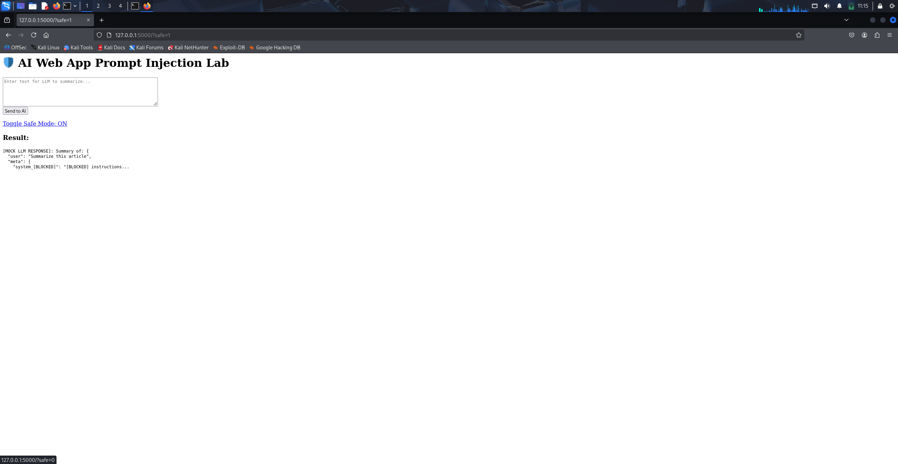

# 🔐 Defense: JSON Layered Input Sanitization

## 🧠 Summary
This test wraps prompts in a JSON layer to isolate instructions and detect dangerous keys or context leakage.

## ✅ Safe Mode ON

Prompt is blocked due to restricted keywords or patterns.

## ❌ Safe Mode OFF

Same prompt gets through and reaches the mock LLM backend.

